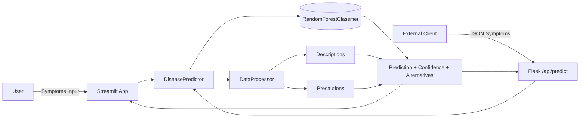
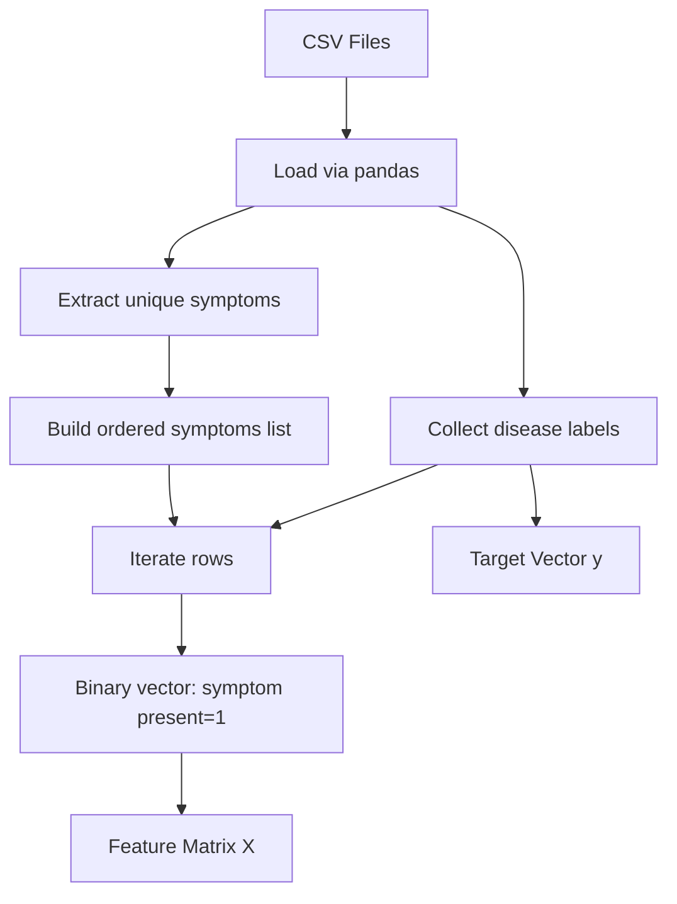
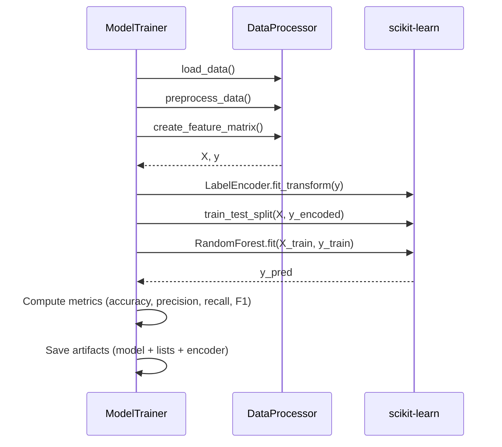
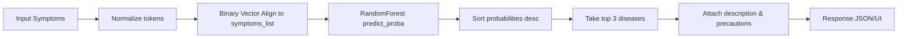
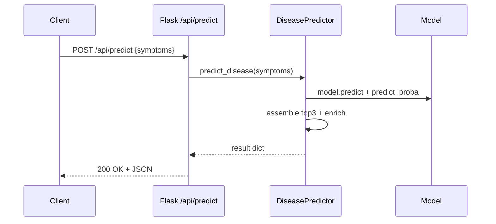

# MediTalk Architecture & Model Overview

> Comprehensive reference covering datasets, processing pipeline, model training, prediction logic, user interfaces (Web, API, Voice), and deployment flows.

## Table of Contents

1. Goals & Scope
2. High-Level System Overview
3. Datasets & Semantic Roles
4. Data Processing & Feature Engineering
5. Model Training Pipeline
6. Stored Artifacts / Models Directory
7. Prediction Flow & Confidence Logic
8. API Layer Design
9. Streamlit Web App Structure
10. Voice Interface Workflow
11. Error Handling & Validation Strategy
12. Extensibility & Future Enhancements
13. Deployment Considerations
14. Quick Start Run Recipes
15. Glossary

---

## 1. Goals & Scope

MediTalk provides an educational AI assistant that ingests symptom sets and outputs disease predictions plus descriptive context and precaution recommendations. This document explains every moving part so new contributors can onboard quickly.

**Primary Goals:**

- Convert tabular symptom–disease relationships into a binary feature space.
- Train a supervised multi-class classifier (Random Forest) for disease prediction.
- Serve predictions via Web UI, REST API, and (optionally) voice interface.
- Return top alternatives with probabilities to support differential diagnosis exploration.

---

## 2. High-Level System Overview



**Key Components:**

- `DataProcessor`: Loads, cleans, and transforms raw symptom/disease CSVs.
- `ModelTrainer`: Orchestrates end-to-end training, saving artifacts to `models/`.
- `DiseasePredictor`: Loads model & metadata; performs inference and assembles results.
- `Streamlit UI (app.py)`: Interactive symptom entry, visualization, recommendations.
- `Flask API (api_server.py)`: Programmatic access for external integrations.
- `VoiceInterface`: Optional speech I/O abstraction (text-to-speech & recognition).

---

## 3. Datasets & Semantic Roles

| File | Purpose | Key Columns |
|------|---------|-------------|
| `data/dataset.csv` | Core mapping of diseases to symptom columns (Symptom_1..N) | Disease, Symptom_* |
| `data/symptom_Description.csv` | Narrative disease descriptions | Disease, Description |
| `data/symptom_precaution.csv` | Four precaution recommendations per disease | Disease, Precaution_1..4 |
| `data/Symptom-severity.csv` | Weighting for symptom severity (currently unused in model training—available for future enhancements) | Symptom, weight |

**Observations:**

- Every row in `dataset.csv` = one disease instance with up to N listed symptoms.
- Symptoms normalized to lowercase underscored tokens (e.g. `high_fever`).
- Description & precautions joined post-prediction for user context.

---

## 4. Data Processing & Feature Engineering



**Steps:**

1. Identify all columns starting with `Symptom_`.
2. Aggregate unique non-null symptom values, strip whitespace, sort => `all_symptoms`.
3. For each dataset row: initialize zero vector length = number of unique symptoms; set indices to 1 for symptoms present.
4. Accumulate vectors -> `X` (shape: rows × unique_symptoms).
5. Collect diseases -> `y` and label-encode for model.

**Potential Enhancements:**

- Use severity weights from `Symptom-severity.csv` to weight features.
- Add TF-IDF style weighting if duplicates or frequency matter.
- Engineer co-occurrence or symptom cluster features.

---

## 5. Model Training Pipeline



**Hyperparameters (current):**

- `n_estimators=100`
- `max_depth=20`
- `min_samples_split=5`
- `min_samples_leaf=2`
- `n_jobs=-1` (parallel training)

**Metrics Printed:** Accuracy, Precision, Recall, F1 (weighted). Current training run produced a perfect 1.0 (likely due to potential data leakage or limited diversity). Consider cross-validation to validate generalization.

**Artifacts Saved:**

- `models/disease_model.pkl`
- `models/label_encoder.pkl`
- `models/symptoms_list.pkl`
- `models/diseases_list.pkl`

---

## 6. Stored Artifacts / `models/` Directory

| Artifact | Type | Purpose |
|----------|------|---------|
| `disease_model.pkl` | RandomForestClassifier | Performs multi-class prediction |
| `label_encoder.pkl` | LabelEncoder | Maps encoded integers back to disease strings |
| `symptoms_list.pkl` | list[str] | Ordered index for binary feature vector construction |
| `diseases_list.pkl` | list[str] | All known diseases (UI & API exposure) |

---

## 7. Prediction Flow & Confidence Logic



**Response Schema:**

```json
{
  "primary_disease": "Bronchial Asthma",
  "confidence": 0.85,
  "description": "...",
  "precautions": ["take deep breaths", "..."],
  "alternative_diseases": ["Pneumonia", "Common Cold"],
  "alternative_probabilities": [0.12, 0.03],
  "input_symptoms": ["high_fever", "cough", "fatigue"],
  "recognized_symptoms": ["high_fever", "cough", "fatigue"]
}
```

**Validation:** `validate_symptoms` splits input into valid vs invalid tokens; invalid listed for user correction.

---

## 8. API Layer Design (`api_server.py`)

**Endpoints:**

- `GET /api/health` – service heartbeat
- `POST /api/predict` – main inference; expects JSON `{"symptoms": [...]}`
- `POST /api/validate-symptoms` – returns validity breakdown
- `GET /api/symptoms` – list of all known symptoms
- `GET /api/diseases` – list of diseases
- `GET /api/disease/<name>` – description & precautions
- `GET /api/stats` – basic metadata

**Error Codes:**

- `400` malformed or missing symptom list
- `500` initialization/prediction errors
- `404` unknown route

**Sequence (Predict):**



---

## 9. Streamlit Web App (`app.py`)

**Pages:** Home · Symptom Checker · Disease Database · About.

- Maintains in-memory `DiseasePredictor` & optional `VoiceInterface`.
- Symptom Checker supports raw text or multiselect list.
- Displays confidence color-coded: high (>70%), medium (>40%), low (≤40%).
- Provides alternative disease probabilities & disclaimers.

**UI Improvement Ideas:**

- Add severity weighting visualization.
- Provide autocomplete search for symptoms.
- Add chart of top probability distribution.

---

## 10. Voice Interface Workflow


**Notes:**

- Requires working audio drivers / input device.
- Graceful fallback if initialization fails (warning displayed in UI).

---

## 11. Error Handling & Validation Strategy

| Layer | Concern | Strategy |
|-------|---------|----------|
| Input | Unknown symptoms | Return `invalid_symptoms` list |
| Model Load | Missing artifacts | Raise & instruct user to run training |
| API | Bad JSON schema | 400 + descriptive message |
| UI | Empty submission | Show error banner |
| Voice | Device unavailable | Warn and disable voice features |

---

## 12. Extensibility & Future Enhancements

- Integrate severity weights into prediction scoring.
- Add probabilistic calibration (Platt scaling or isotonic regression).
- Export model metrics to monitoring dashboard.
- Multi-language symptom mapping layer.
- Cloud object storage for model artifacts (e.g., S3/Azure Blob).
- Containerize & add CI pipeline (lint, test, security scan).

---

## 13. Deployment Considerations

| Aspect | Recommendation |
|--------|---------------|
| Environment | Use Python 3.10–3.12 for broader wheel support (3.13 acceptable with updated deps). |
| Container | Multi-stage build: install deps → copy src/data → run training if needed. |
| Ports | Streamlit 8501; Flask API 5000; expose both or unify behind reverse proxy. |
| Logging | Add structured logging (JSON) for requests & predictions. |
| Security | Rate-limit API; sanitize input; add auth for production. |
| Monitoring | Track latency, error rate, top symptom combos. |

---

## 14. Quick Start Run Recipes

```powershell
# 1. Create & activate venv
python -m venv venv
./venv/Scripts/Activate.ps1

# 2. Install dependencies
python -m pip install --upgrade pip
pip install -r requirements.txt

# 3. Train model (from project root)
python src\model_trainer.py

# 4. Launch Streamlit app
streamlit run src\app.py

# 5. (Optional) Start API server in another terminal
python src\api_server.py

# 6. Sample API request (PowerShell)
curl -Method POST http://localhost:5000/api/predict -ContentType "application/json" -Body '{"symptoms":["high_fever","cough"]}'
```

---

## 15. Glossary

| Term | Definition |
|------|------------|
| Symptom Vector | Binary list marking presence of each known symptom for an instance. |
| Feature Matrix `X` | 2D array (instances × symptoms) used for training. |
| Label Encoder | Maps disease strings ↔ integer class IDs. |
| Confidence | Probability associated with the predicted primary disease. |
| Alternative Diseases | Next highest probability classes (top 2 after primary). |
| Model Artifacts | Serialized files required for inference (stored in `models/`). |

---

### Disclaimer

This system is **not** a substitute for professional medical advice. Outputs are informational and should be validated by qualified healthcare professionals.

---

### Diagram Rendering

If Mermaid does not render in your environment (e.g., on plain GitHub without extension), install a Markdown preview extension that supports Mermaid or convert diagrams to PNG via a doc build pipeline.

---

End of Architecture & Model Overview.
